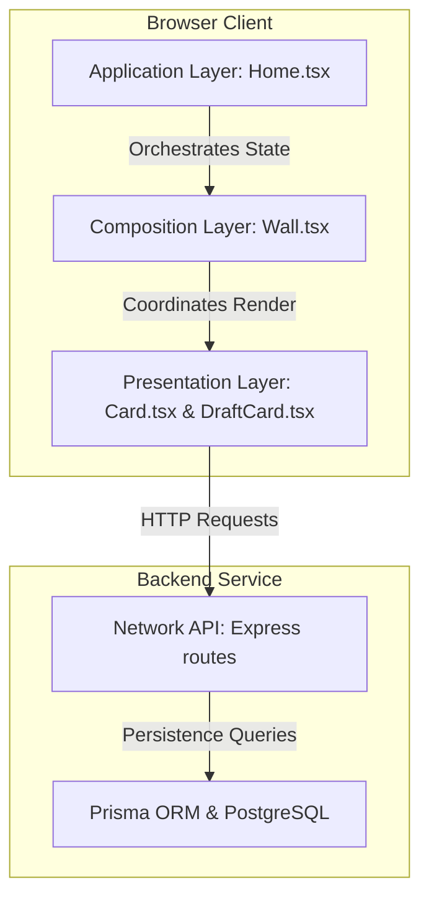
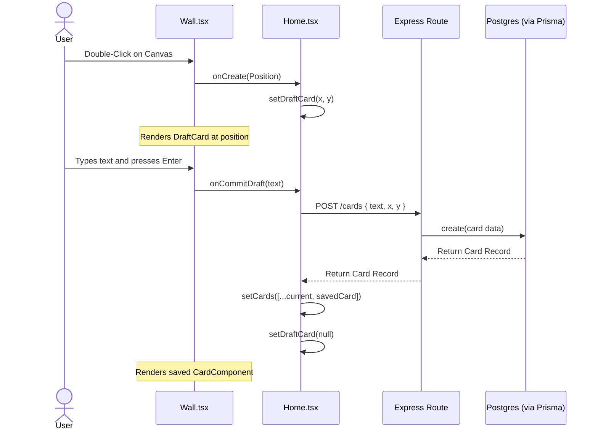
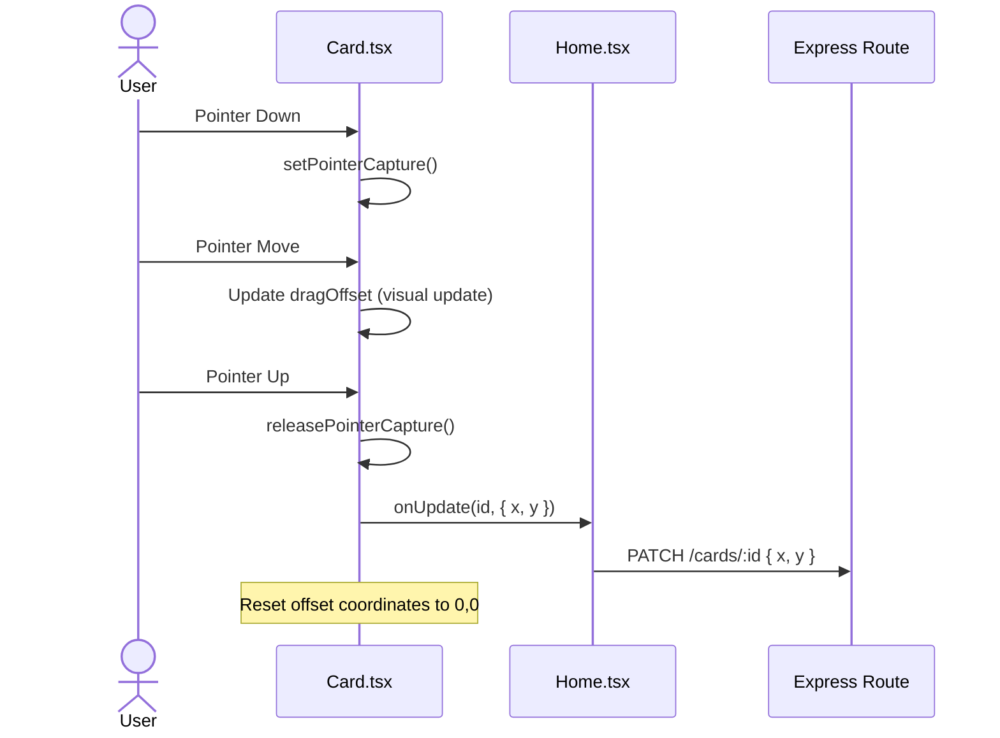

# Nook System Architecture

This document maps out the architecture and design patterns of the Nook digital workspace, detailing how requests move through the stack and describing layer responsibilities.

---

## Layered Architecture Pattern

Nook follows a strict unidirectional, layered pattern dividing concerns between browser client layout management and backend data persistence.



---

## Architectural Layers

### 1. Application Layer (`Home.tsx`)
* **Role**: Primary controller and coordinator of the screen's main page.
* **Responsibilities**:
  * Owns the core state hooks for the list of persisted notes (`cards`) and transient overlay drafts (`draftCard`).
  * Initiates initial database queries upon component mount (`useEffect`).
  * Integrates with Auth service wrappers to manage cookie/token deletion on logout.
  * Implements action-callbacks (`handleUpdateCard`, `handleDeleteCard`, `handleCommitDraft`) that translate client events into network requests.

### 2. Composition Layer (`Wall.tsx`)
* **Role**: Layout Orchestrator (Canvas Container).
* **Responsibilities**:
  * Defines the absolute coordinate grid space (representing the digital wall).
  * Captures mouse double-clicks on the blank wall to determine relative positioning coordinates:
    ```typescript
    x: e.clientX - rect.left
    y: e.clientY - rect.top
    ```
  * Iterates and maps over active cards and conditional draft overlays.
  * Directs clean callback signals up to the Application controller while isolating sub-components.

### 3. Presentation Layer (`Card.tsx` & `DraftCard.tsx`)
* **Role**: Pure UI elements (Visual block notes).
* **Responsibilities**:
  * **`Card.tsx`**: Renders text values and edit-mode input fields. Manages pointer capturing hooks (`setPointerCapture`) and state variables representing active drag-and-drop displacements (`dragOffset`).
  * **`DraftCard.tsx`**: Displays absolute text areas, forces cursor focus, and watches keyboard events (`Enter` and `Escape`) to commit or close drafts.
  * Implements `e.stopPropagation()` on double clicks to ensure that interacting with note actions doesn't trigger new drafts on the parent canvas.

### 4. Network API Layer (`services/` & Express routes)
* **Role**: Backend controller and route handler.
* **Responsibilities**:
  * **Frontend Services**: Wrapper classes utilizing `fetch` to build JSON request payloads and append token authorizations.
  * **Express Router**: Mounts authentication validation filters and processes payloads into service controllers.

### 5. Persistence Layer (`Prisma` & `PostgreSQL`)
* **Role**: Database controller.
* **Responsibilities**:
  * **Prisma**: Maps JavaScript structures to type-safe database queries.
  * **PostgreSQL**: Stores cards schema (user references, text content, coordinate points, and generation timestamps).

---

## Interaction Lifecycles

### 1. Creating a Note (Wall-First Flow)



### 2. Moving a Note (Drag and Drop Flow)


