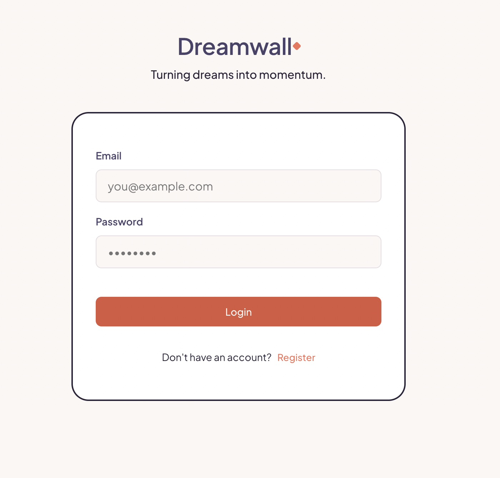
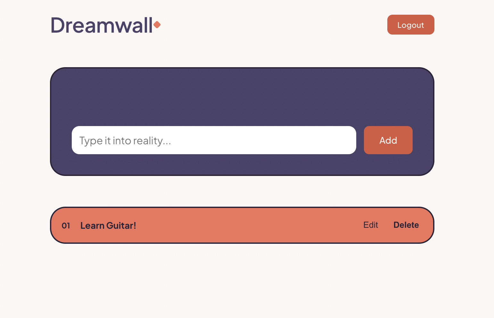
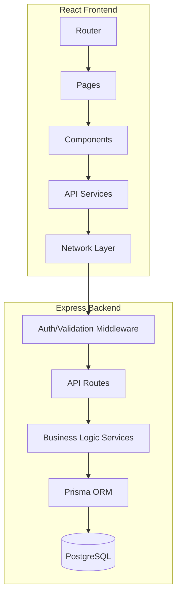

# Dream Wall

Dream Wall is a minimal full-stack application that evolved from a simple CRUD app into a production-oriented backend through iterative engineering. Honestly, I wanted to explore how full stack works and this project made me understand it deeply.

Instead of building multiple tutorial projects, every version introduces one real engineering concept while preserving the same product.

Current Version: **v3.0.0**

---

## Why Dream Wall?

Most tutorial projects are abandoned after they work.

Dream Wall follows a different philosophy.

The same product evolves over time.

Each version introduces one new engineering challenge:

- SQLite → PostgreSQL
- Raw SQL → Prisma
- JavaScript → TypeScript
- Business Logic → Service Layer
- Route Validation → Middleware
- Local Project → Production Ready
- **Fullstack Integration → React & Vite**

The goal isn't to build many projects.

The goal is to build one project well.

---

## Tech Stack

### Frontend

- React
- TypeScript
- Vite

### Backend

- Express
- TypeScript
- Prisma
- PostgreSQL

---

## Screenshots

### Login Page


### Home Page


---

## Quick Start

```bash
git clone ...

cd dream-wall

npm install
cd dream-wall-frontend
npm install
cd ..

cp .env.example .env
# Also copy frontend env
cp dream-wall-frontend/.env.example dream-wall-frontend/.env

npm run setup

# Run backend
npm run dev

# Run frontend in a new terminal
cd dream-wall-frontend
npm run dev
```

## Architecture



## Documentation
- [Architecture](docs/architecture.md)
- [Setup](docs/setup.md)
- [Roadmap](docs/roadmap.md)
- [Release Notes](docs/release_notes)
- [ADRs](docs/adr)

## Engineering Philosophy
- Build incrementally.
- Ship before adding complexity.
- Pass data, not frameworks.
- Stable interfaces enable replaceable implementations.
- Optimize for the next developer.

## Features

- Create dreams
- Update dreams
- Delete dreams
- User Registration
- User Login
- JWT Authentication
- Protected Routes
- User-owned Dreams
- Logout
- PostgreSQL
- Prisma
- React


## Authentication

All protected routes require

Authorization

Bearer <JWT>