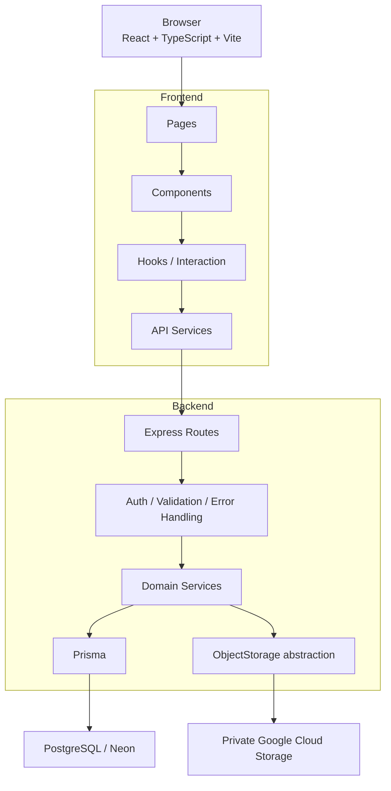
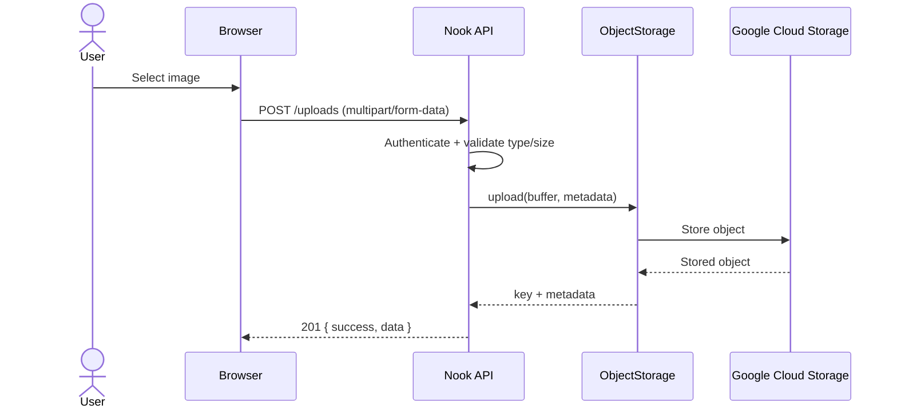
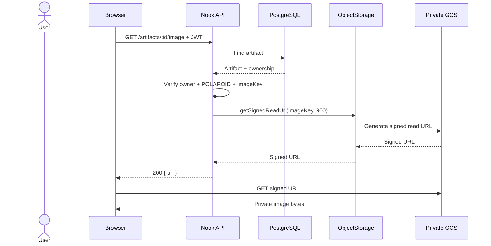
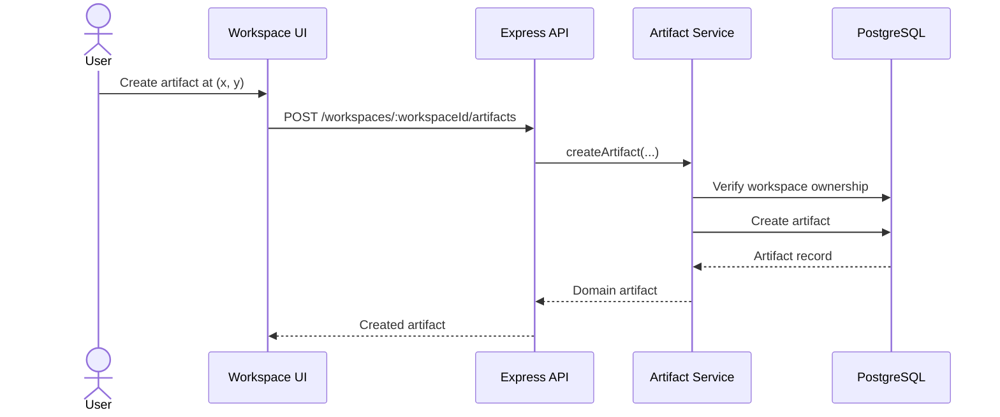

# Nook System Architecture

This document describes the current architecture of Nook and the responsibilities of each major layer.

The system is intentionally split between:

1. a spatial React client responsible for interaction and presentation;
2. an Express API responsible for authentication, authorization, validation, and orchestration;
3. domain services responsible for application behavior;
4. Prisma/PostgreSQL responsible for relational persistence; and
5. an object-storage abstraction responsible for private media.

---

## High-level architecture



---

## Frontend architecture

The frontend is organized around the workspace rather than around a generic dashboard.

### Pages

Pages establish route-level composition and application boundaries.

They should not contain database or storage logic. API communication is delegated to frontend service modules.

### Components

Components render workspace UI and artifacts.

The current artifact vocabulary is:

- `TEXT`
- `LINK`
- `POLAROID`

Components receive artifact data and interaction callbacks rather than directly owning persistence.

### Hooks and interaction logic

Interaction behavior is separated from presentation where practical.

Important interaction concerns include:

- editing
- dragging
- selection
- workspace-level editing ownership
- draft creation
- optimistic movement updates

A key invariant is that editing and dragging should not compete for the same pointer interaction.

### Services

Frontend service modules wrap HTTP calls to the backend.

The upload service, for example, sends a `multipart/form-data` request to:

```text
POST /uploads
```

The frontend does not upload directly to Google Cloud Storage.

---

## Backend architecture

The backend follows a layered request flow:

```text
HTTP request
    ↓
Express route
    ↓
Authentication / validation middleware
    ↓
Application service
    ↓
Prisma / ObjectStorage
    ↓
Response
```

### Routes

Routes translate HTTP requests into application-service calls.

Current route groups:

```text
/auth
/workspaces
/uploads
/artifacts
/health
```

Routes should remain thin: authentication, parameter parsing, response formatting, and delegation belong here.

### Services

Services contain application behavior and authorization-sensitive operations.

Examples:

- user registration/login
- workspace ownership checks
- artifact creation/update/deletion
- image upload validation
- Polaroid image authorization and signed URL generation

This keeps Prisma-specific operations out of the route layer.

### Prisma

Prisma is the relational persistence boundary.

The core relational model is:

```text
User
  │
  └── Workspace
        │
        └── Artifact
```

An artifact also belongs to a user.

The current artifact schema stores flexible type-specific content in PostgreSQL JSON:

```text
TEXT      → { text }
LINK      → { url }
POLAROID  → { imageKey }
```

Spatial properties remain first-class columns:

```text
x
y
zIndex
```

This keeps positioning queryable without coupling the database schema to every artifact content shape.

---

## Object storage architecture

Binary media is deliberately separated from relational artifact data.

```text
Artifact
  │
  └── content.imageKey
          │
          ▼
    ObjectStorage
          │
          ▼
 Google Cloud Storage
```

The backend uses:

```ts
interface ObjectStorage {
  upload(
    buffer: Buffer,
    metadata: {
      key: string;
      contentType: string;
    },
  ): Promise<StoredObject>;

  getSignedReadUrl(key: string, expiresInSeconds: number): Promise<string>;
}
```

This abstraction keeps application logic independent of Google Cloud Storage and makes the storage boundary replaceable.

---

## Upload flow

Uploads currently use server-mediated multipart upload.



Accepted image types:

- `image/jpeg`
- `image/png`
- `image/webp`

Maximum size:

```text
10 MB
```

Object keys follow:

```text
uploads/users/{userId}/{uuid}.{extension}
```

The bucket is private by default.

---

## Private Polaroid image retrieval

Polaroid images are not public bucket objects.

The browser first calls:

```text
GET /artifacts/:id/image
Authorization: Bearer <JWT>
```

The API then:

1. validates the artifact ID;
2. finds the artifact;
3. verifies that the authenticated user owns it;
4. verifies that the artifact is a `POLAROID`;
5. extracts `imageKey`;
6. asks `ObjectStorage` for a short-lived signed read URL;
7. returns the URL as JSON.



The current signed URL lifetime is 15 minutes.

Returning JSON rather than issuing an HTTP redirect is intentional. It keeps the authenticated API request and the cross-origin storage request as separate browser operations.

---

## Workspace and artifact flow

### Create artifact



### Move artifact

The frontend can update spatial coordinates through:

```text
PATCH /workspaces/:workspaceId/artifacts/:id
```

The service persists the new coordinates after the workspace/user ownership checks.

The interaction is designed so that the visual drag can remain responsive while persistence happens through the API.

### Delete artifact

Deletion is scoped by:

```text
artifact id
user id
workspace id
```

This prevents a user from deleting an artifact outside the workspace they own.

---

## Authorization model

Authentication is JWT-based.

Protected workspace and artifact operations use the authenticated user identity to enforce ownership.

The important boundary is:

```text
authenticated user
        ↓
workspace ownership
        ↓
artifact ownership / workspace membership
        ↓
media access
```

Media access therefore does not depend on knowing an object key alone. The API first establishes that the requesting user is authorized to access the artifact.

---

## Error handling

The backend uses centralized error handling.

Validation and application errors are converted into HTTP responses by the global error handler rather than being formatted independently by every route.

This keeps route behavior predictable and prevents storage/database errors from leaking implementation details to clients.

---

## Health and deployment

The backend exposes:

```text
GET /health
```

The health check verifies database connectivity using Prisma before returning a successful response.

Production deployment:

```text
GitHub Actions
    ↓
Docker build
    ↓
Artifact Registry
    ↓
Google Cloud Run
    ↓
Nook API
```

See [`docs/deployment.md`](./docs/deployment.md) for the deployment workflow.

---

## Architectural principles

### 1. Keep routes thin

Routes handle HTTP concerns and delegate application behavior to services.

### 2. Keep binary data out of PostgreSQL

Artifacts store media references (`imageKey`), not image bytes.

### 3. Keep storage replaceable

The `ObjectStorage` interface isolates the application from the concrete storage provider.

### 4. Authorize before generating media access

A signed URL is generated only after the API verifies ownership and artifact type.

### 5. Keep spatial state first-class

Coordinates are persisted independently of artifact content so spatial behavior is part of the domain model rather than UI-only state.

### 6. Separate interaction from persistence

The browser owns interaction state; the backend owns durable application state.

### 7. Prefer explicit domain concepts

The system uses `Workspace`, `Artifact`, `ArtifactType`, and `ObjectStorage` rather than leaking UI-specific concepts such as old card-only terminology into the backend.
