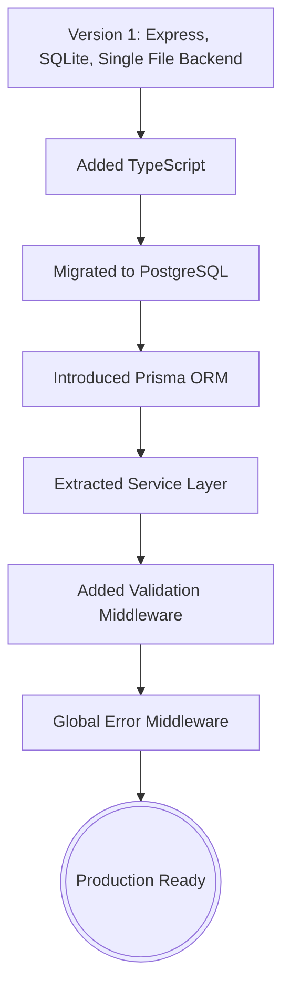

# Dream Wall Architecture

## Purpose
This document explains how Dream Wall is structured and why architectural decision exists.
The goal is to help contributors understand the system before reading the code.

## Philosophy

Dream Wall follows a layered backend architecture designed around a few core principles:
- Every request moves through a predictable pipeline.
- Each layer owns exactly one responsibility.
- The goal is to keep the codebase easy to understand, test and extend.

---

## Request Lifecycle

The application processes requests in a strict, top-down flow. Layers generally only communicate with the layer directly beneath them.

- **1. Browser:** Sends HTTP Requests.
- **2. Express:** Receives the request and routes it into the application.
- **3. Middleware:** Performs cross-cutting concerns (like input validation) before business logic runs.
- **4. Routes:** Understand HTTP. They extract request parameters and format JSON responses.
- **5. Services:** Understand Dreams (Business Logic). They enforce application rules independent of HTTP.
- **6. Prisma:** Translates application operations into type-safe database queries.
- **7. PostgreSQL:** Stores persistent data.

---

## Why this architecture?

As the project evolved, responsibilities that were originally handled entirely inside route files were gradually extracted into dedicated layers.

Examples of refactoring:
- Raw SQL queries → Extracted to **Services**
- Input checking → Extracted to **Validation Middleware**
- Manual `try/catch` blocks → Extracted to **Global Error Middleware**
- Database Connection Logic → Extracted to **Prisma Client**

Each refactor reduced code duplication and improved maintainability *without changing the public API*.

## Engineering Principles

- **One responsibility per layer.**
- **Pass data, not frameworks.** (e.g., Services should not know about Express `req` or `res` objects).
- **Stable interfaces, replaceable implementations.**
- **Optimize for the next developer.**

---

## Evolution

Dream Wall was not built this way on day one. It evolved naturally as complexity grew:

Future versions will extend this architecture without changing its overall structure.

Upcoming additions include:
- Authentication
- Authorization
- AI Services
- Background Jobs