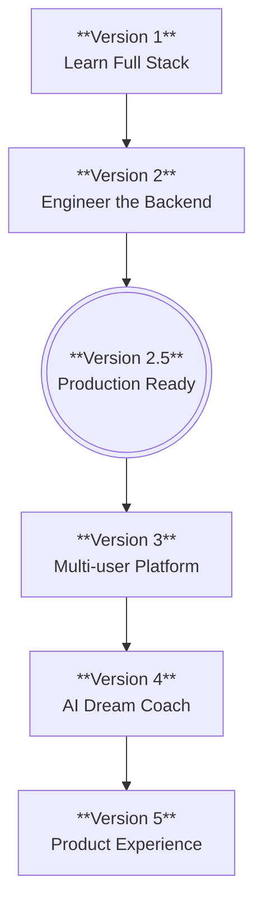

# Dream Wall Roadmap

Dream Wall is built in distinct, intentional phases. Instead of doing everything at once, each version has a single, clear objective.

### 📍 Current Phase: Version 2.5 (Production Ready)
We are currently solidifying the backend architecture. This means setting up global error handling, data validation, and ensuring the PostgreSQL/Prisma integration is rock solid before we start adding complex features like users or AI.

### 🚀 Future Phases
- **Version 3 (Multi-user Platform):** Adding authentication and authorization so multiple users can have their own private walls.
- **Version 4 (AI Dream Coach):** Integrating AI services to analyze dreams and provide insights or interpretations.
- **Version 5 (Product Experience):** Polishing the frontend UI, adding animations, and ensuring a seamless, beautiful user experience.