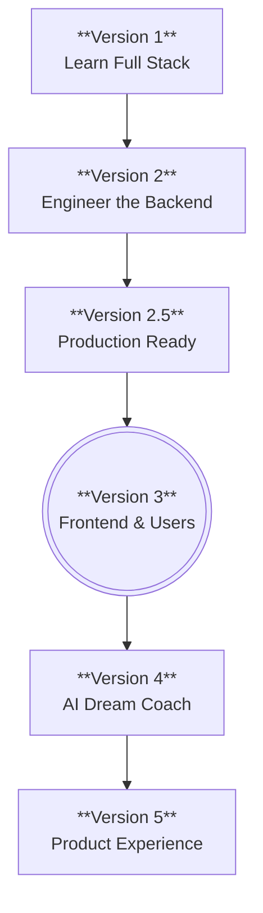

# Nook Roadmap

Nook is built in distinct, intentional phases. Instead of doing everything at once, each version has a single, clear objective.

### 📍 Current Phase: Version 3.0.0 (Frontend & Users)
We have successfully implemented the React/Vite frontend and a strict structural design system. We also added full JWT authentication and authorization, allowing multiple users to have their own private walls.

### 🚀 Future Phases
- **Version 4 (AI Dream Coach):** Integrating AI services to analyze dreams and provide insights or interpretations.
- **Version 5 (Product Experience):** Polishing the frontend UI, adding animations, and ensuring a seamless, beautiful user experience.